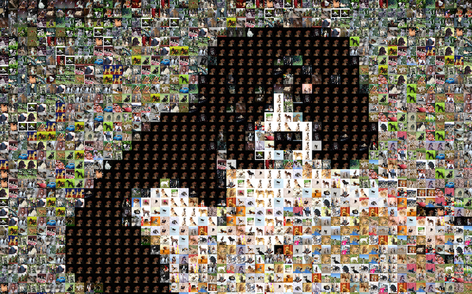

# Photo Mosaic

I have used Daniel Shiffmans's code from his [Photo Mosaic with White House Coding Challenge](https://thecodingtrain.com/challenges/49-photo-mosaic-with-white-house-social-media-images)
to create a photo mosaic tribute to my wonderful dog Bella.

## Dogs

There are lots of places to find a dataset of images.  One of the easiest is Kaggle, which is where I downloaded the [Standford Dogs dataset](https://www.kaggle.com/datasets/jessicali9530/stanford-dogs-dataset).  This dataset consists of over 20,000 images of 120 dog breeds and is really designed to be used for image classification.  Because of this, the images are arranged in one folder for each dog breed. Once I downloaded the dataset, I moved a portion of the images into one folder named dogs to load into the Processing sketch.  (Hint:  you must have the folder of images in the Processing sketch folder.  Click on Sketch and Show Sketch Folder to find it. You can then drag the folder of images into your Processing sketch folder.)  The code that I used is on the Coding Train website.

